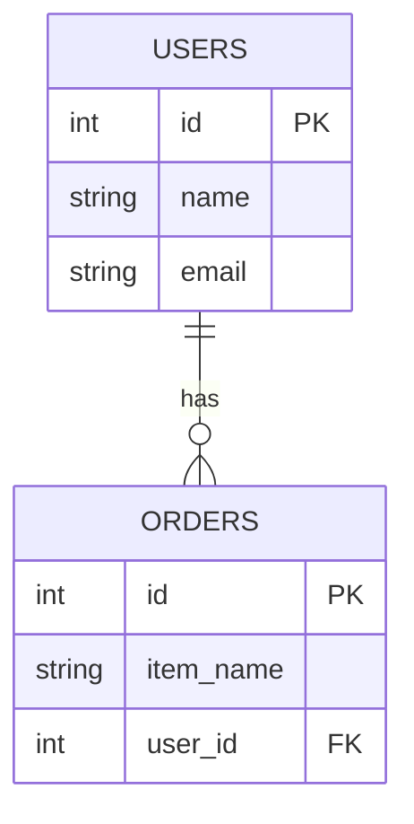

# 🗄️ Relational Database

A **Relational Database** is one of the most commonly used types of databases in backend development. It organizes data into **tables** that are related to each other, making it powerful, structured, and easy to query using **SQL (Structured Query Language)**.

---

## 📖 What is a Relational Database?

A **Relational Database (RDB)** stores data in the form of **rows and columns** (just like Excel). Each table represents a specific entity (e.g., users, products, orders), and relationships are established between them using **keys**.

---

## 📊 Example Table: `users`

| id  | name  | email           |
| --- | ----- | --------------- |
| 1   | Rafly | rafly@email.com |
| 2   | Ade   | ade@email.com   |

### Key Concepts:

- **Row**: A single record (e.g., one user)
- **Column**: A field/attribute (e.g., name, email)
- **Primary Key**: A unique identifier for each row (usually `id`)
- **Foreign Key**: A reference to a primary key in another table

---

## 🔗 Example Relationship

Let's say you have two tables: `users` and `orders`.

- Each **user** can have **many orders** (One-to-Many relationship)
- `orders.user_id` is a **foreign key** pointing to `users.id`

### Diagram:



---

## 🧠 Why Use a Relational Database?

| Benefit                | Explanation                              |
| ---------------------- | ---------------------------------------- |
| ✅ Data integrity      | Enforced using primary/foreign keys      |
| ✅ Structured querying | SQL makes it easy to query complex data  |
| ✅ ACID compliance     | Ensures data consistency and reliability |
| ✅ Relationships       | Natural way to connect related data      |

---

## 🧪 Popular Relational Databases

| Name           | Description                                    |
| -------------- | ---------------------------------------------- |
| **PostgreSQL** | Open-source, powerful, widely used             |
| **MySQL**      | Fast, open-source, common with PHP apps        |
| **SQLite**     | Lightweight, file-based, great for prototyping |
| **MariaDB**    | Fork of MySQL with open governance             |
| **SQL Server** | Developed by Microsoft                         |

---

## 💻 Common SQL Commands

```sql
-- Create a table
CREATE TABLE users (
  id SERIAL PRIMARY KEY,
  name VARCHAR(100),
  email VARCHAR(100)
);

-- Insert data
INSERT INTO users (name, email) VALUES ('Rafly', 'rafly@email.com');

-- Select data
SELECT * FROM users;

-- Create relationship
CREATE TABLE orders (
  id SERIAL PRIMARY KEY,
  item_name VARCHAR(100),
  user_id INT REFERENCES users(id)
);
```

---

## ⚒️ Tools to Explore Databases

Here are some popular tools you can use to manage and explore relational databases:

| Tool                | Description                             |
| ------------------- | --------------------------------------- |
| **pgAdmin**         | GUI tool for PostgreSQL                 |
| **DBeaver**         | Universal database client for many DBs  |
| **MySQL Workbench** | Official GUI for MySQL databases        |
| **TablePlus**       | Fast, lightweight client with modern UI |

---

## 📚 Best Practices for Relational Databases

- ✅ **Always define primary keys** to uniquely identify each record.
- 🔗 **Use foreign keys** to enforce relationships between tables.
- 🧹 **Normalize your database** to reduce redundancy and maintain consistency.
- ⚡ **Use indexes** on frequently queried columns to improve performance.

---

## 🧠 Summary

- A **Relational Database** organizes data into tables with structured relationships using primary and foreign keys.
- It’s widely used in backend systems and accessed through **SQL**.
- Proper design enables your application to be scalable, consistent, and reliable.
- Mastering relational databases is essential for any backend developer.

---
