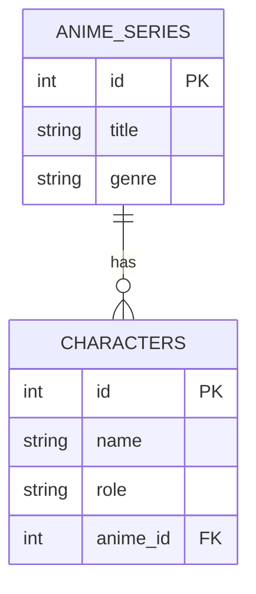

# 🐘 PostgreSQL: Powerful Open-Source Relational Database

**PostgreSQL** (pronounced: _Postgres_) is one of the most popular relational database management systems (RDBMS) in the world. It’s open-source, reliable, feature-rich, and widely used by companies ranging from small startups to large enterprises.

---

## 📌 Why Use PostgreSQL?

PostgreSQL is ideal for backend applications because it supports many powerful features:

- ✅ Open-source and free to use
- ✅ ACID compliant (safe and consistent transactions)
- ✅ Advanced SQL support (CTE, JOIN, window functions, etc.)
- ✅ JSON and array support (semi-relational capabilities)
- ✅ Extensible (custom functions using SQL, Python, etc.)
- ✅ Powerful indexing (B-Tree, GIN, BRIN)
- ✅ Large and active community with great documentation

---

## 🔧 Installing PostgreSQL

### Windows

> Download from: https://www.postgresql.org/download/windows/

### macOS

```bash
brew install postgresql
```

### Ubuntu / Debian

```bash
sudo apt update
sudo apt install postgresql postgresql-contrib
```

---

## 🔧 GUI Tools (Optional)

| Tool      | Description                         |
| --------- | ----------------------------------- |
| pgAdmin   | Official GUI tool for PostgreSQL    |
| DBeaver   | Universal multi-database GUI client |
| TablePlus | Lightweight modern UI for databases |

---

## 🧪 Example: Anime Character Database

Imagine you're building a system to store **anime series** and their **characters**. Here's how you can model the data in PostgreSQL:

---

### 1. 📦 Table Structure

```sql
CREATE TABLE anime_series (
  id SERIAL PRIMARY KEY,
  title VARCHAR(100),
  genre VARCHAR(50)
);

CREATE TABLE characters (
  id SERIAL PRIMARY KEY,
  name VARCHAR(100),
  role VARCHAR(50),
  anime_id INT REFERENCES anime_series(id)
);
```

### 2. ➕ Insert Sample Data

```sql
INSERT INTO anime_series (title, genre)
VALUES
  ('Naruto', 'Shounen'),
  ('Attack on Titan', 'Action');

INSERT INTO characters (name, role, anime_id)
VALUES
  ('Naruto Uzumaki', 'Main', 1),
  ('Sasuke Uchiha', 'Rival', 1),
  ('Eren Yeager', 'Main', 2);
```

### 3. 🔍 Query with JOIN

```sql
SELECT c.name AS character, c.role, a.title AS anime
FROM characters c
JOIN anime_series a ON c.anime_id = a.id;

```

📌 Expected Output:
| character | role | anime |
|------------|--------|------------|
| Naruto Uzumaki | Main | Naruto |
| Uchiha Sasuke | Rival | Naruto |
| Eren Yeager | Main | Attack On Titan |

---

## 🧩 Relationship Diagram



---

## ⚙️ Integration with Backend (Node.js + pg)

```js
const { Pool } = require("pg");

const pool = new Pool({
  user: "postgres",
  host: "localhost",
  database: "anime_db",
  password: "your_password",
  port: 5432,
});

async function getCharacters() {
  const result = await pool.query(`
    SELECT c.name, a.title 
    FROM characters c 
    JOIN anime_series a ON c.anime_id = a.id
  `);
  console.log(result.rows);
}
```

---

## ✅ Best Practices

- Always define primary keys for each table
- Use foreign keys to maintain data relationships
- Normalize your schema to reduce redundancy
- Add indexes on frequently queried columns
- Avoid storing large binary files (e.g., images) directly in the database

---

## 🌍 Use PostgreSQL in the Cloud

Don’t want to install PostgreSQL locally? Try these cloud services:

| Platform                                    | Description                                |
| ------------------------------------------- | ------------------------------------------ |
| [ElephantSQL](https://www.elephantsql.com/) | Simple hosted PostgreSQL                   |
| [Supabase](https://supabase.com/)           | PostgreSQL + RESTful API & Auth            |
| [Render](https://render.com/)               | Fullstack app & DB hosting                 |
| [Railway](https://railway.app/)             | Developer-friendly database & app platform |

---

## 🧠 Summary

- PostgreSQL is a robust, modern, and extensible relational database.
- It supports both structured and semi-structured data.
- Ideal for backend development, scalable for enterprise-grade systems.
- Easy to use with various languages and frameworks (Node.js, Python, Go, etc.)
