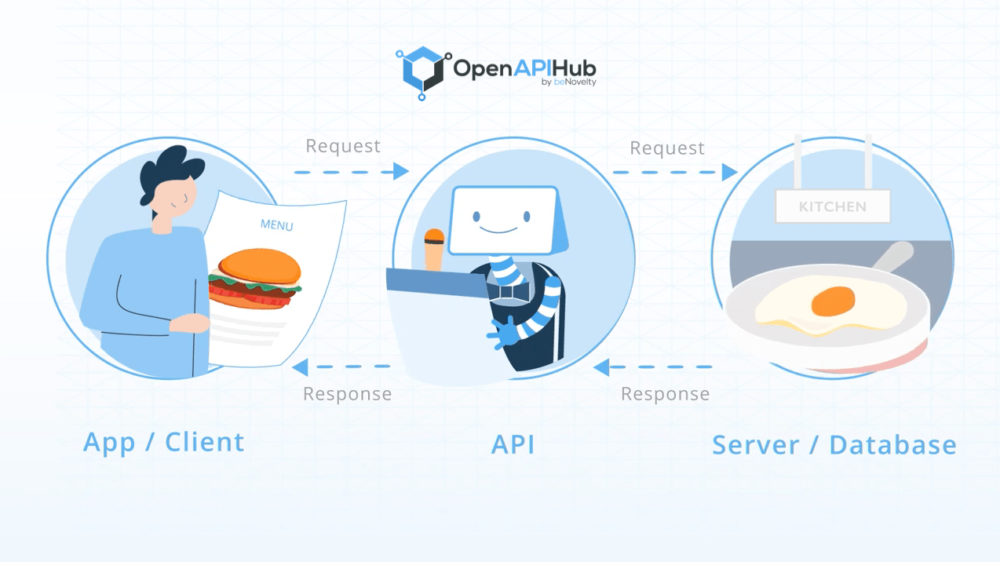

# 🌐 APIs — A General Overview

An **API (Application Programming Interface)** is a **contract** that lets two pieces of software exchange information in a predictable way.

---

## 🍽️ Restaurant Analogy

_Figure 1 – A restaurant‑style analogy of client ↔︎ API ↔︎ server._

| Role in Picture                    | Represents             | Quick Note                                                        |
| ---------------------------------- | ---------------------- | ----------------------------------------------------------------- |
| **App / Client** (customer + menu) | Web / mobile front‑end | Reads the **menu** (API docs) and decides what to request.        |
| **API** (waiter/robot)             | API layer / gateway    | Validates the order and passes it to the server.                  |
| **Server / Database** (kitchen)    | Business logic + DB    | “Cooks” the request—runs code, queries data, returns result.      |
| **Request → Response** arrows      | Network calls          | Client sends a request ➜ server processes ➜ API returns response. |

**TL;DR**  
The client orders from a menu (API spec), the API delivers the order to the kitchen (server/database), the kitchen prepares the dish (data), and the API serves the final plate (response) back to the client.

---

## 🚀 Why APIs Matter

| Purpose           | What It Enables                                                                                  |
| ----------------- | ------------------------------------------------------------------------------------------------ |
| **Communication** | Web apps, mobile apps, micro‑services, and IoT devices can exchange data seamlessly.             |
| **Abstraction**   | Clients ask _what_ they need, not _how_ it’s built—internal complexity stays hidden.             |
| **Reusability**   | Multiple projects or teams can reuse the same functionality by calling the same interface.       |
| **Scalability**   | Decoupled services can evolve and deploy independently.                                          |
| **Ecosystems**    | Third‑party developers can safely build on top of your platform (e.g., Stripe, Twitter, GitHub). |

---

## 🧩 Core Building Blocks

| Concept                      | Description                                                                  |
| ---------------------------- | ---------------------------------------------------------------------------- |
| **Endpoint / Route**         | URL or method clients hit (e.g., `/api/v1/users`).                           |
| **Request**                  | HTTP verb (`GET`, `POST`, …), headers, optional body (payload).              |
| **Response**                 | Status code (`200`, `404`, etc.), headers, and data (JSON, XML, binary).     |
| **Protocol / Format**        | Rules that govern the exchange: REST/HTTP, GraphQL, gRPC, WebSocket, SOAP.   |
| **Authentication / AuthZ**   | Proves _who_ you are and _what_ you’re allowed to do (JWT, OAuth, API keys). |
| **Documentation / Contract** | Human‑ & machine‑readable spec (OpenAPI/Swagger, GraphQL SDL, `.proto`).     |

---

## 🗺️ Road‑map for Learning APIs

The image roadmap breaks the topic into several focused modules.  
Below is how this README will guide you through them:

1. **API Paradigms**

   - **REST & JSON APIs** ✅
   - GraphQL, gRPC, SOAP ▸ compare strengths & trade‑offs
   - HATEOAS & Hypermedia concepts

2. **Open API Specifications**

   - Swagger / OpenAPI files, code generation, mock servers

3. **Authentication & Authorization**

   - **JWT, OAuth** ✅
   - Basic Auth, Token Auth, Cookie‑based Auth
   - OpenID Connect & SAML

4. **Interaction Tactics** _(coming soon)_
   - Versioning, pagination, rate‑limiting
   - Caching headers, error‑handling patterns

> **Goal:** Understand the _philosophy_ of APIs first.  
> Each detailed topic later will show _how_ to design, secure, and scale real‑world interfaces.

---

## 🧠 Summary

- An API is a structured way for software to talk.
- It abstracts complexity, encourages reuse, and powers ecosystems.
- Mastering APIs means mastering **endpoints, protocols, auth, and documentation**—the pillars of modern backend development.
