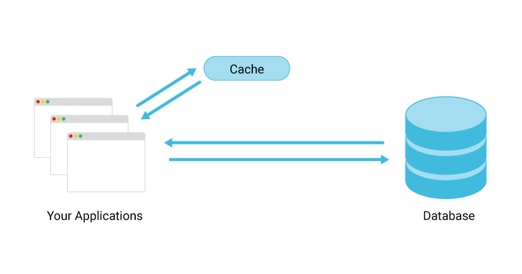

# ⚡ Caching in Backend Systems

Caching is the process of **storing frequently accessed data in temporary storage** (called a cache) to make future data retrieval faster and reduce load on the primary database.

---

  

> _Figure: Applications check the cache first. If not found (cache miss), they query the database._  
> Source: [ScyllaDB – Database Caching](https://www.scylladb.com/glossary/database-caching/)

In the image above:

- 🖥 **Your Applications** are client-facing services that need to access data.
- 💾 The **Cache** is placed between the application and the database.
  - When a user requests data, the application **first queries the cache**.
  - If the data is **found in the cache** (cache hit), it is returned immediately.
  - If the data is **not found** (cache miss), the application then queries the **Database**.
- The result from the database is then **stored in the cache** for faster access next time.

This pattern significantly reduces database queries for frequently requested data, improves speed, and enhances scalability.

---

## 🧠 How Caching Works

1. **Client Requests Data**
2. **Application checks the cache**
   - If the data is found (**cache hit**), it returns immediately.
   - If not found (**cache miss**), the app queries the database.
3. **If cache miss**, data is fetched from the database, returned to the client, and **stored in the cache** for next time.

---

## 🚀 Why Use Caching?

| Benefit             | Explanation                                    |
| ------------------- | ---------------------------------------------- |
| ⚡ Faster Responses | Reduce latency by serving data instantly       |
| 💪 Reduced Load     | Offload frequent reads from your database      |
| 🌍 Scalable Systems | Handle more users with the same infrastructure |
| 💰 Cost-Efficient   | Reduce expensive DB reads, especially at scale |

---

## 🧪 Common Caching Tools

| Tool             | Description                                                        |
| ---------------- | ------------------------------------------------------------------ |
| **Redis**        | In-memory key-value store, very fast and popular for caching       |
| **Memcached**    | Lightweight and simple cache, suitable for short-lived data        |
| **Local Memory** | In-process cache (e.g., LRU cache), suitable for small apps or dev |

---

## ⚠️ Cache Invalidation

One of the hardest problems in caching is knowing **when to remove or update cached data**.

Strategies include:

- **TTL (Time-To-Live):** Data auto-expires after a set time
- **Manual Invalidation:** Manually remove/update cache when data changes
- **Write-Through / Write-Behind:** Sync cache and database automatically

---

## 🧠 Summary

- Caching helps improve performance and reduce database pressure.
- Always check the cache before hitting the database.
- Use tools like **Redis** or **Memcached**.
- Implement invalidation logic carefully to avoid stale data.
